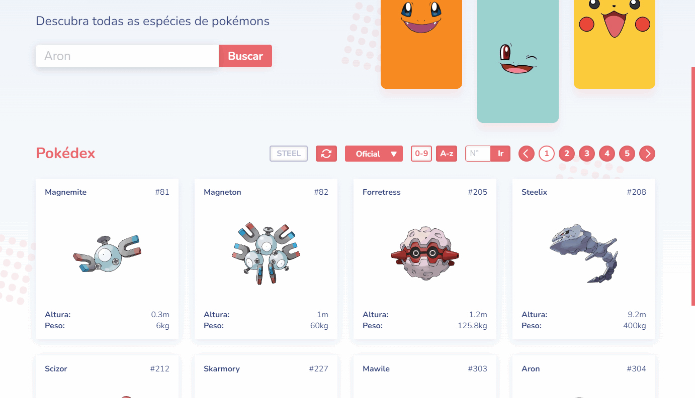
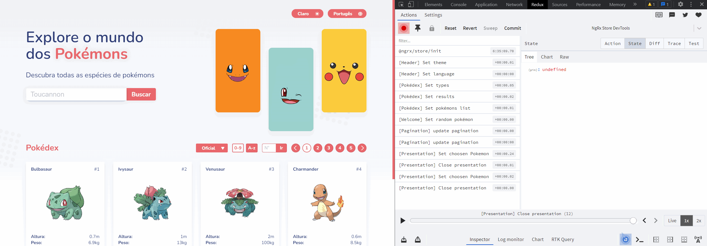
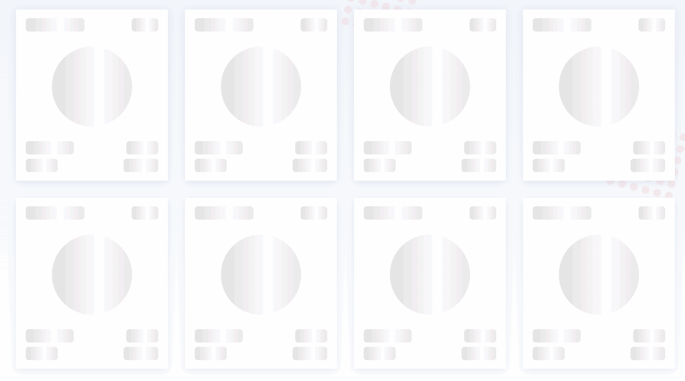
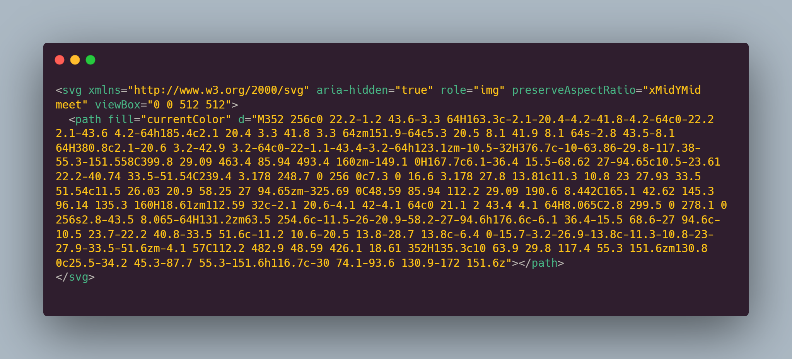
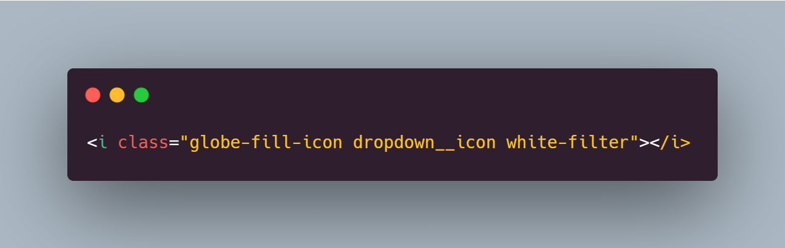
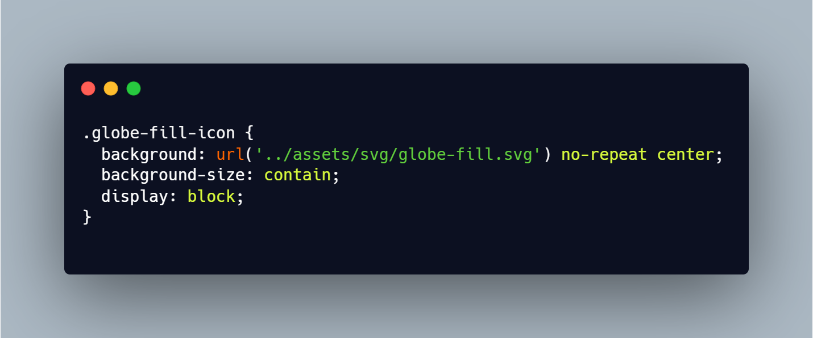
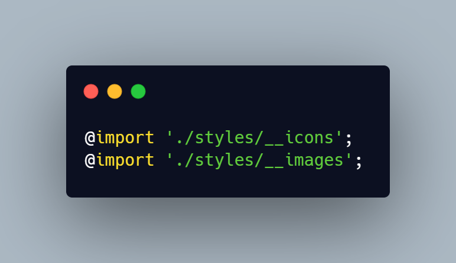

<h1 align="center"><b>Pokédex</b></h1>

Shows more than a thousand pokemons and theirs stats

<strong>
<a href="https://thalyssonleite.github.io/pokedex">Experimente a aplicação no ar</a>
</strong>
<strong>
<a href="https://thalyssonleite.github.io/pokedex">See the application online</a>
</strong>

    <a href="#tecnologias">Tecnologias</a> •
    <a href="#features">Features</a> •
    <a href="#decisões">Decisões</a> •
    <a href="#autor">Autor</a>

---

### <b>Tecnologias</b>

- [x] <b style="font-size: 12px">Angular</b>
- [x] <b style="font-size: 12px">TypeScript</b>
- [X] <b style="font-size: 12px">RXJS</b>
- [x] <b style="font-size: 12px">HTML</b>
- [x] <b style="font-size: 12px">CSS (SCSS)</b>
- [X] <b style="font-size: 12px">Redux (NGRX)</b>

---
### <b>Features</b>

- [X] <b style="font-size: 12px"><i>Paginação</i></b> responsiva com navegação direta

    
- [X] <b style="font-size: 12px"><i>Ordenação</i></b> alfabética e numérica
  
    
- [x] <b style="font-size: 12px"><i>Pesquisa</i></b> híbrida por espécie e tipo de pokémon

    
- [x] <b style="font-size: 12px"><i>Temas</i></b> claro e escuro 

    
- [x] <b style="font-size: 12px"><i>Traduções</i></b> para Inglês, Espanhol e Português (com suas unidades de medidas)

    
- [x] <b style="font-size: 12px"><i>Gerenciamento de Estado</i></b> por `NGRX` <a href="https://chrome.google.com/webstore/detail/redux-devtools/lmhkpmbekcpmknklioeibfkpmmfibljd?hl=pt-BR"><b style="font-size: 12px">(instale a extensão para navegador)</b></a>

    
- [X] <b style="font-size: 12px"><i>Responsividade</i></b> até 280px de largura (Galaxy Fold)

  
---
### <b>Decisões</b>

- [X] <b style="font-size: 13px">Nada de `Bootstrap`, `Material Design`, `Font Awesome` ou `Tailwind`</b>
  
    Foi utilizado em todo o projeto CSS puro, como SCSS como pre-processador. Por que não usar bibliotecas CSS, os famosos "frameworks"? Usar CSS puro em todas as ocasiões me permite organizar melhor meu html, de forma que se você olhar o `DevTools` pelo navegador não vai ver uma coleção indistinta de classes estranhas juntas, serão nomes semânticos como `pagination`, `card`, `stat`, `search-bar`, `welcome`, `banner`. 

    O código fica mais limpo, fácil de entender e de dar manutenção. Graças aos componentes não existe repetição de código. E ao invés de eu pesar o projeto com centenas de `utility classes` que esses "frameworks" provêem, eu criei as minhas próprias e as disponibilizei globalmente, não passaram de 10. 

    Usar CSS puro me abre um leque maior de possibilidades. Por exemplo, se reparar na responsividade vai perceber que existem inúmeros breakpoints encaixados de forma quase perfeita para cada tamanho de tela, seja ele qual for, esse detalhismo que fez toda a diferença certamente seria impraticável senão impossível com esses "frameworks".

    Algumas animações somente possíveis com CSS foram adicionadas. Se eu tivesse focado em usar somente alguma biblioteca do gênero meu trabalho teria ficado mais do mesmo, sem muito apelo visual. É claro que para usar todo o poder do CSS sem criar um pattern caótico é necessário domínio e esse foi um dos motivos de eu ter escolhido usar CSS puro. Num contexto de um projeto talvez seja preferível, por outros fatores, utilizar alguma biblioteca do gênero, mas isso não será um problema. Porque quem domina o CSS irá dominar qualquer framework seja ele `Bootstrap`, `Material Design`, `Font Awesome` ou `Tailwind`.

    <i>Abaixo algumas as animações de loading que aparecem depois 280ms caso os cards pokémon não tenham sido carregados, inclusive esse delay também foi setado via CSS (pela compressão do `gif` a imagem pode ficar cerrilhada).</i>

    <!--  -->

    <!--  -->

- [X] <b style="font-size: 13px">Lógica e componente de paginação feitos sem bibliotecas</b>

  Toda a lógica de paginação de items foi criada para funcionar em qualquer cenário e não estar acoplada dentro ao layout, uma classe TypeScript fornece todos os dados necessários. Isso me dá liberdade para criar inúmeros componentes com sua própria identidade visual.

  Lembrando que esta lógica pode ser aproveitada em qualquer lugar da aplicação criando um componente versátil e especial em sua essência.
  
  Neste caso não usar uma biblioteca me deu a possibilidade de adaptar a lógica para que os números nunca fiquem grande demais, caso os números de paginação crescam, ou pequenos demais, caso eles fiquem muito pequenos, veja o exemplo abaixo e observe como os números diminuem quando passamos de 10 para 100 e para 1000:

  
- [X] <b style="font-size: 13px">Uso de gerenciamento de estado</b>

  O gerenciamento de estado me ajudou em diversas situações no debug e numa aplicação maior faria toda a diferença. Durante o desenvolvimento do projeto foi de vital importância a compreensão visual do estado da aplicação. Usando a extênsão para navegador ficou claro o que estava acontecendo e que gargalos de perfomance poderiam ser diminuídos e como fazer isso.

  Ter uma estrutura bem definida, uma única fonte de onde todos os componentes podem beber, cria um código mais previsível e organizado.
- [X] <b style="font-size: 13px">`__icons.scss` e `__images.scss` patern</b>
  
  O que é melhor? Isso:

  

  ou isso:

  

  As classes `white-filter` e `dropdown__icon` setam a cor e as dimensões do ícone respectivamente. Mas o que faz a classe `globe-fill-icon`? Ela carrega a referência do svg importado como background. Uma `utility class` criada a mão que pode ser usada globalmente na aplicação, se este ícone mudar no futuro, ele será alterado em apenas 1 lugar e todos os lugares onde ele é chamado refletirão o resultado, o que não iria acontecer por exemplo se importássemos a referência do arquivo dentro de uma `ìmg` tag, se o import mudasse TODOS os lugares onde aquela imagem fosse chamada não iriam mais funcionar.

  Nas classes com esse pattern usamos o sufixo `icon` para ícones e `image` para imagens. A coleção desses ícones estão dentro de um único arquivo scss que vai ser importado dentro do `styles.scss`, a partir daí essas classes ficarão distribuídas globalmente na aplicação.

  Esse é um exemplo de como uma classe é criada dentro do arquivo `__icons.scss`:

  

  Depois os arquivos partials `__icons.scss` e `__images.scss` serão importados dentro de `styles.scss` onde ficarão disponíveis globalmente:

  
---
### <b>Autor</b>

 Made with 🧡 and madness by Thalysson 🥛<a href="https://www.google.com/search?q=milk+in+portuguese&oq=milk+in+portuguese&aqs=chrome..69i57.4303j0j1&sourceid=chrome&ie=UTF-8">(click here if you are not brazilian)</a>

